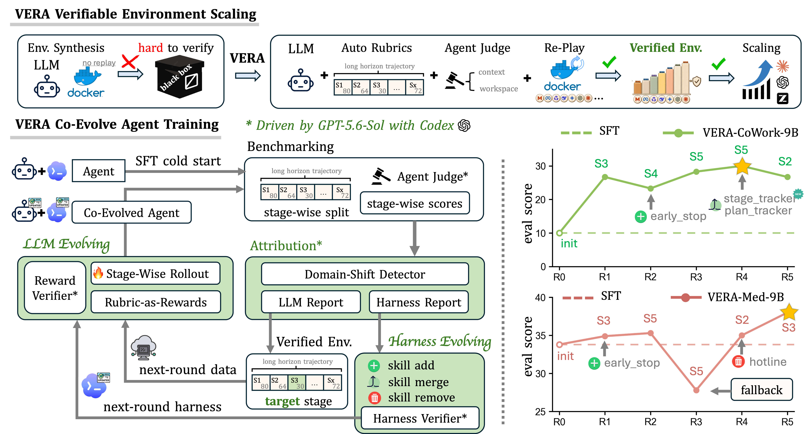
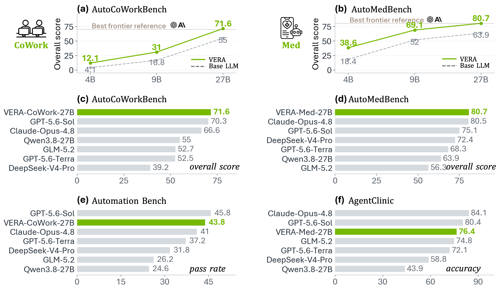
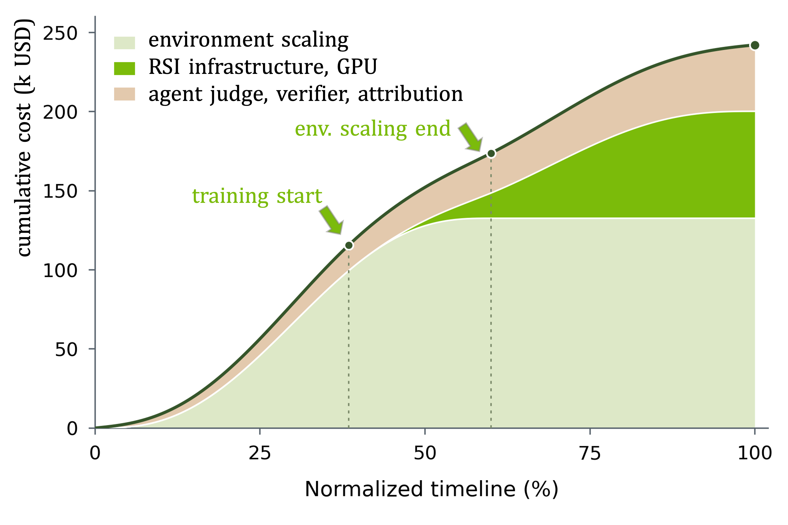

# VERA: Scaling Verifiable Environments for Agentic co-Evolution

[](https://github.com/AutoMedBench/VERA)
[](#)
[](#)
[](#)

<!-- TODO: fill in the Paper, Model, and Data links on release. -->

**VERA** (*Verifiable Environments for Agentic co-Evolution*) builds verifiable
environments at scale and lets agents evolve on them. An agent writes rubrics
and executable checks, an Agent Judge verifies each sandbox, and only
environments that pass enter the training bank. On these environments, VERA
alternates between two updates — train the model with rubric rewards, or edit
the harness skills — with a verifier that accepts each change only if it
improves. This attribution is what distinguishes VERA's co-evolution from
single-axis baselines: updates target the *cause*, not just the *outcome*.



**VERA enables model–harness co-evolution through verifiable environments.**
*Top:* auto-generated rubrics, Agent Judge workspace checks, and container
replay verify environments before scaling. *Bottom left:* attribution uses
stage-wise scores and traces to produce an LLM Report selecting training
stages and a Harness Report proposing skill additions, merges, or removals;
the Reward Verifier checks rubric rewards and the Harness Verifier tests
skill edits, with updates alternating while the other component stays frozen.
*Right:* CoWork and MedResearch scores across co-evolution rounds.

## News

- **[2026-10]** Code release (this repository). The environment corpus and
  trained artifacts are **not** part of the initial release; release plans
  will be announced here.

## Highlights

| | |
| --- | --- |
| **Verifiable environments at scale** | `9,000+` restartable, rubric-scored sandboxes built from benchmark trajectories across CoWork and Medical Research |
| **Co-evolution, not single-axis tuning** | At 9B, the co-evolved agent beats the strongest single-axis baseline by **+10.3** (AutoCoWorkBench) and **+13.0** (AutoMedBench) Overall points |
| **Frontier-level at 27B** | **71.6** Overall on AutoCoWorkBench (above Claude Opus 4.8) and **80.7** on AutoMedBench, with the highest Agentic score (**94.1**) |
| **Transfer without contamination** | **43.8%** on Automation-Bench and **76.4%** on AgentClinic — neither used in sandbox construction |
| **Capabilities retained at 27B** | The CoWork agent improves on all four general benchmarks (AIME 2026, ALFWorld, GPQA-Diamond, IF-Bench) |

## Results



**VERA improves agents across model sizes and achieves competitive
performance with a 27B backbone.** *(a–b)* Co-evolution improves on the base
agents at 4B, 9B, and 27B. *(c–d)* VERA-27B achieves the highest Overall
scores among the compared agents on AutoCoWorkBench and AutoMedBench.
*(e–f)* On Automation-Bench (public 600) and AgentClinic, VERA-27B improves
over its base agent by 19.2 and 32.5 percentage points, ranking second and
third among the compared systems.

### Main results at 9B (Qwen3.5-9B)

| Method | AutoCoWorkBench O | SWE-Bench Verified P@1 | AutoMedBench O | MedXpertQA Text P@1 |
| --- | --- | --- | --- | --- |
| Qwen3.5-9B + Prompt | 12.0 | 44.0 | 22.1 | 40.8 |
| ADAS (harness evolving) | 20.7 | 52.4 | 55.5 | 42.0 |
| GRPO (LLM evolving) | 5.8 | 14.8 | 36.3 | 22.3 |
| VERA Harness only | 18.2 | 53.6 | 56.1 | 42.7 |
| VERA LLM only | 18.9 | 51.2 | 43.3 | 45.3 |
| **VERA Agent (co-evolved)** | **31.0** | **54.2** | **69.1** | **50.8** |

Freezing either axis forfeits roughly half the gain: on AutoMedBench,
LLM-only reaches 43.3 and harness-only 56.1, against 69.1 for the full loop.
At 27B, the agents in the teaser figure reach 71.6 Overall on AutoCoWorkBench
and 80.7 on AutoMedBench (94.1 Agentic, the highest among compared agents),
with out-of-domain transfer covered by panels (e–f) of the same figure.

## RSI cost analysis



**Environment preparation dominates the estimated RSI cost in Medical
Research.** The estimated cumulative allocation totals approximately \$240k:
environment scaling and curation **54.7%**, training infrastructure **27.9%**,
verification, judging, attribution, and orchestration **17.3%**. Model–harness
co-evolution begins after ~75% of environment preparation, so training and
curation overlap. The normalized timeline illustrates the schedule rather
than measured spending.

## Repository

### Branches

| Branch | Purpose |
| --- | --- |
| `vera-coevolve` | Model/harness co-evolution, evaluation feedback, skill selection and resumable controllers |
| `vera-harness` | Codex-based runtime, MCP tools, skill catalogs and versioned harness profiles |

The default branch is `vera-coevolve`. These are the repository's only two branches.

### Layout

- `src/eva_agent/training/coevolution.py` — observed stage deficits and comparable feedback.
- `training/eva_rsi/` — resumable round controller, durable checkpoint accounting,
  evaluation, attribution, versioned skill selection and retained evidence.
- `integrations/native/harness_coevolution/` — authenticated public training
  feedback, candidate generation/review, paired trials, promotion and safe boundaries.
- `training/harness_source.py` — explicit selection of a separate EVRA checkout.
- `plugins/evamed-codex/` — the audited skill catalog shared with the `vera-harness` branch.
- `docs/` — architecture, agent judge, runtime and integration notes.

Internal `eva_agent` / `evamed` module and schema names are retained for
compatibility. VERA / EVRA are the release-facing names; this is not a renamed
Codex binary or a claim of new benchmark results.

### Quick start

Python 3.11+ is required.

```bash
python -m pip install -e '.[dev]'

# Focused CPU checks (synthetic software checks, not GPU qualification
# or medical efficacy)
python -m pytest -q tests/test_coevolution.py tests/test_eva_rsi_loop.py
```

The controller's commands are explicit and do not start training on import.
Configure it with your own workspace paths and external assets. For a separate
harness checkout, set `EVA_HARNESS_ROOT` before importing the `eva_agent`
package.

See [privacy boundaries](PRIVACY.md) and
[third-party notices](THIRD_PARTY_NOTICES.md). No credentials, private
datasets, benchmark answers, live-job configuration, model weights or training
logs are shipped. This repository is research software, not a clinical device.

## Blog

- [VERA: Scaling Verifiable Environments for Agentic co-Evolution](docs/blog/) — method and results with the paper's figures and tables, plus the RSI cost analysis and report-driven co-evolution examples.

## Citation

```bibtex
@article{liu2026vera,
  title={VERA: Scaling Verifiable Environments for Agentic co-Evolution},
  author={Liu, Junqi and Pan, Yongyang and Jiang, Zhuosong and Li, Dongbai and
           Zhang, Bo and Ling, Xitong and Liu, Tianyu and Ye, Hanrong and
           He, Yufan and Zhao, Can and Guo, Pengfei and Yang, Dong and
           Myronenko, Andriy and Zhou, Yuyin and Xu, Daguang and Tang, Yucheng},
  year={2026},
  journal={Technical report}
}
```

## License

Apache License 2.0. See [LICENSE](LICENSE) for details.
