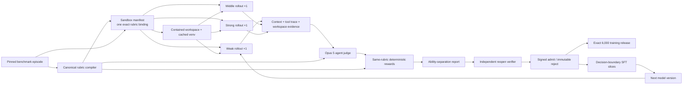

# EVA-Agent architecture

## Scope and release contract

This repository implements the medical-research portion of EVA:

- the benchmark-to-sandbox-to-trajectory data pipeline; and
- the Codex-based EvaMed coding-agent harness used to execute tool-rich
  trajectories.

The production target is exact: 6,000 verifier-grounded training sandboxes.
The unchanged split fields remain present for compatibility, with campaign
quotas of 6,000 training, 0 development, and 0 sealed evaluation.
Construction, successful rollout, or a high judge score is not admission.
Only a signed admission receipt plus a signed supervisor transition can
advance the public counter.

The training allocation is source-balanced: 1,500 each from AutoMedBench,
MedXpertQA, AgentClinic, and HealthBench Professional. Every S1–S5/E2E stage
totals 1,000. AutoMedBench's 1,500 follow the pinned source's native 1:2:2:5
track mix: 150 classification, 300 detection, 300 segmentation, and 750
research.

Generated data, credentials, private benchmark answers, and raw provider
responses are not source-controlled.

## End-to-end data flow



The rubric edge entering both `J` and `Q` is the central invariant: the judge
and reward code receive the same compiled object identity and digest.

## Rubric system

The canonical source is
`rubrics/source/domain-stage-tables.v1.json`. Compilation enforces:

- one table per domain × stage key;
- five to ten atomic and observable items per table;
- complete benchmark or explicitly supplemental provenance;
- UUID runtime identities and canonical BLAKE3 commitments;
- safe context/workspace evidence selectors;
- deterministic normalized weights and hard-gate semantics; and
- immutable in-memory compiled objects.

The registry covers AutoMedBench classification, detection, segmentation, and
research, plus MedXpertQA, AgentClinic, and HealthBench Professional. Each has
S1, S2, S3, S4, S5, and E2E tables. Native benchmark outcome metrics remain a
separate gate surface; they are not mislabeled as workflow-process rubrics.

Each `SandboxManifest` records exactly one `RubricBinding`. The binding carries
the registry ID/version/digest and table ID/version/digest, making later reward
drift detectable.

## EvaMed Codex harness

EvaMed is an answer-free, stage-aware complex coding agent built on the pinned
open-source Codex SDK/app-server. Its repository-native `evamed-codex` plugin
exposes the existing medical-research tools and skills over MCP. MCP is a
transport adapter, not a schema compiler: it mechanically places each
canonical `input_schema` value under the protocol's `inputSchema` key and
commits the unchanged source bytes and digest in sidecar evidence. A policy is
bound per thread, so same-name tools with different historical schemas are
never merged into a global catalog.

Codex custom providers give GPT-5.6 Sol, Opus, Gemini, Qwen, and DeepSeek one
shared agent runtime. A route is eligible only after its Responses-compatible
canary succeeds; route identity and configuration digests are retained without
credentials. The older OpenAI-SDK-shaped loop is a temporary verified fallback,
not a second semantic implementation.

High-width workers do not launch a new app-server for every turn. A persistent
runtime service owns one async SDK connection and multiplexes independent,
fresh, ephemeral Codex threads from synchronous campaign workers. Calls are
submitted without an extra process-wide throttle; shutdown stops new claims,
drains live turns, and closes app-server once. Provider-specific capacity
remains explicit in campaign configuration rather than hidden in the SDK
bridge.

For every model turn, the harness:

1. sends the complete policy-visible input and only stage-permitted tool
   schemas;
2. lets Codex plan and issue independent MCP calls concurrently;
3. preserves every provider call ID and the original same-turn call group;
4. validates tool names and arguments before execution;
5. runs independent, `parallel_safe` calls under a bounded semaphore;
6. returns each observation to the matching call ID; and
7. commits turns, groups, observations, and the final trajectory with BLAKE3.

The local runtime is the no-HTTP fallback. It provides contained file listing,
reading, literal search, whole-file writing, and argv-only code execution. A
cached venv can be mounted so coding-heavy tasks avoid repeated installation.
It does not invoke a shell, traverse outside the workspace, accept symlinks, or
pass provider credentials into child processes.

Skills are policy-visible tools: a model searches a stage-filtered catalog and
loads only the skill it needs. This implements the project's central thesis:
the model can acquire procedural capability just in time rather than memorize
the entire medical knowledge surface.

## Rollout, judgment, reward, and separation

A valid evaluation batch has exactly one target from each cohort:

| Cohort | Purpose | Typical pool |
| --- | --- | --- |
| weak | expose tasks that do not require meaningful tool skill | Qwen, DeepSeek lower-ability controls |
| middle | measure partial workflow competence | configured middle control |
| strong | establish solvability and golden trajectory candidates | Opus 5/4.8, GPT-5.6 Sol, Gemini 3.1 Pro Preview |

Each selected model runs once. Models are not retried until they pass, and
failures stay immutable. Parallelism exists at two levels: many sandboxes/models
can run concurrently, and each trajectory can execute independent same-turn
tools concurrently.

The Opus 5 judge sees public context, all policy-visible trajectory events,
tool receipts, and before/after workspace evidence. It also receives private
judge-only reference material over a separate boundary. It returns one
evidence-cited score for every bound rubric item. Deterministic reward code
rejects missing/extra items or a rubric-digest mismatch.

The separation report retains weak/middle/strong total rewards, raw item
scores, pairwise gaps, and explicit failed-cohort metadata. Under
`eva.trajectory-admission-policy.v2`, separation is diagnostic: one valid
trajectory with a workspace-aware Opus 5 judgment and exact compiled-rubric
reward can qualify. Provenance, rubric identity, workspace inspection, and
signed supervisor admission remain mandatory.

## Verification and immutable storage

Application identities are UUIDs. Content receipts use BLAKE3; no hash is used
as a runtime identity. Artifact publication uses create-exclusive writes,
read-only files, and sealed run directories. Verification reopens committed
bytes, validates tree topology, recomputes nested receipts, confirms exactly
one rollout per cohort, checks judge/reward rubric identity, and recomputes the
separation report.

The pipeline returns an admission *recommendation*. A separate signed
supervisor remains the admission authority. The dashboard reads only the
transactional campaign ledger's admission quotas and separately exposes its
queued, active, rejected, and infrastructure-quarantine counts.

## SFT slicing and coevolution

Only an evaluation backed by a verified pipeline result, signed admission
receipt, and signed supervisor transition can be sliced. Each SFT example:

- ends at one observable assistant decision;
- includes the policy-visible prefix needed to reproduce that decision;
- keeps all calls from one parallel tool-call group together;
- excludes hidden reasoning and judge-only references; and
- carries BLAKE3 lineage to sandbox, rollout, evidence, evaluation, pipeline
  result, and admission proofs.

Coevolution happens in new versions:

1. admitted golden trajectories teach tool choice, parallel decomposition,
   evidence handling, and workspace discipline;
2. the improved model exposes missing or awkward harness tools;
3. new versioned tools/skills are added with focused tests;
4. fixed sealed evaluation sandboxes detect regressions; and
5. new training candidates are generated under new commitments rather than
   mutating old evidence.

## Parallel production and ETA

The safe maximum is set by independently bounded resources: provider quotas,
workspace I/O, tool CPU/GPU, and the judge queue. A high-throughput deployment
uses separate queues for materialization, cohort rollouts, Opus judgment,
verification, and signing, so one slow provider does not idle the others.

Do not estimate the release from raw API concurrency. Measure a representative
pilot and use signed+verified admissions/hour:

```text
ETA_hours = (6000 - signed_verified_admissions) / measured_admissions_per_hour
```

The dashboard accepts that measured rate with `--rate`. Until the pilot is
complete, it deliberately reports an uncalibrated ETA.
